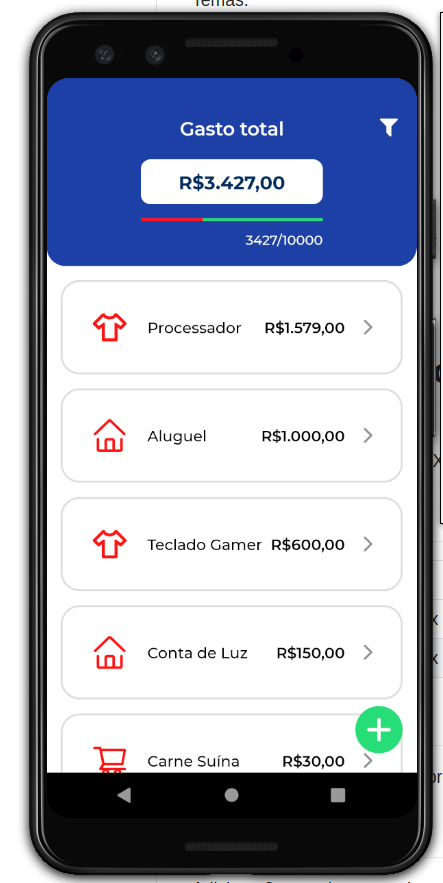
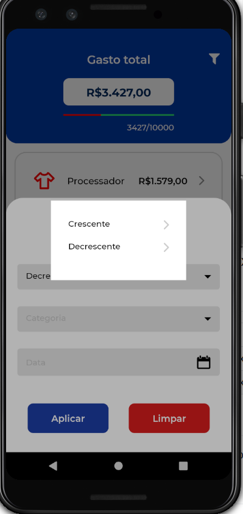
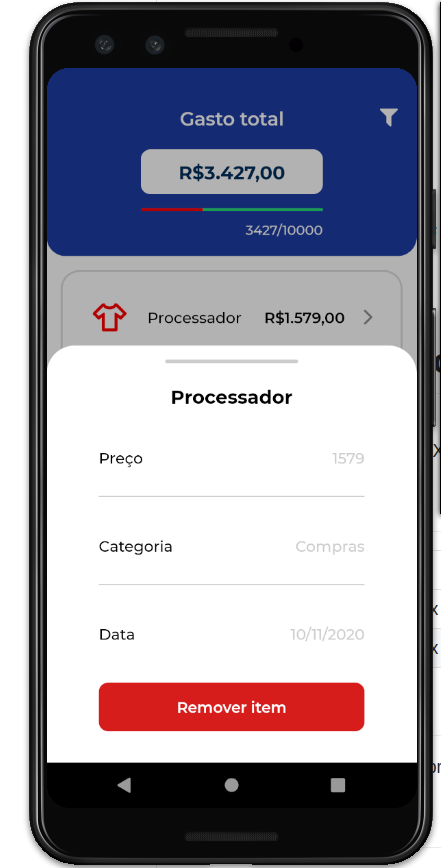
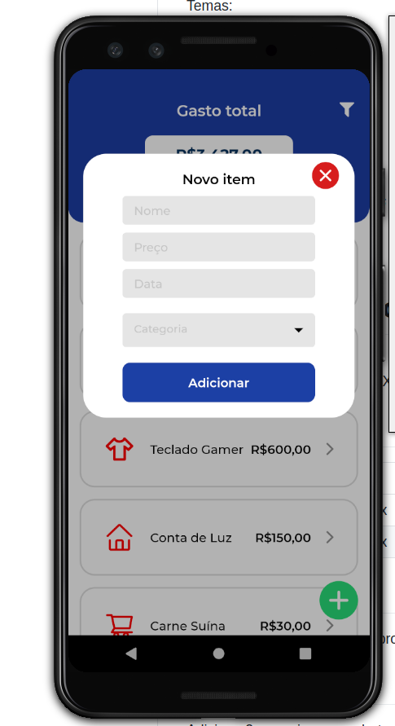

# Se Poupe

**Número da Lista**: 4 
**Conteúdo da Disciplina**: Dividir e Conquistar 

## Alunos

| Matrícula  | Aluno                      |
| ---------- | -------------------------- |
| 17/0102343 | Eduardo Vieira Lima        |
| 17/0114040 | Gabriel Davi Silva Pereira |

## Sobre

Se Poupe é uma aplicação mobile para organização de finanças, visando economia. Controle seus gastos adicionando-os no app.

## Screenshots

|                                  |                                  |
| -------------------------------- | -------------------------------- |
|  |  |
|  |  |

## Instalação

**Linguagem**: Javascript 
**Framework**: React Native 

## Pré-requisitos (Execução local)

    - Expo Cli
    - Smartphone Android ou emulador Android
    - Possuir o app Expo instalado em seu smartphone (Disponível nas lojas de aplicativos)
    - Yarn ou NPM

## Uso

#### Para executar o app:

    - Navegue para a pasta app/
    - Executar yarn install
    - Executar expo start
    - Entrar no app do expo em seu celular
    - Ler qrcode que será mostrado no terminal após expo start

    Ou

    - Baixe o apk disponível no arquivo SePoupe.apk na raiz do projeto e instale em seu celular.

## Outros

Para a ordenação dos itens o app utiliza uma implementação de Dividir e Conquistar no template de MergeSort.
